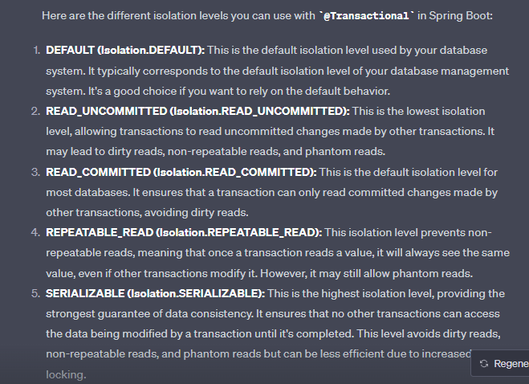

# <h1><b> Advanced Java Knowledge like a Brain Godam 🙋 </b></h1>

 <b>1) What is Serialization and deserialization ? <br/></b> 
      <b><u>Answer:- </u></b> <br/>
     @https://github.com/MdGolam-Kibria/JavaBrainStore/tree/master/src/main/java/com/CrackCode/SerializationDeserialization <br/>
     
 <b>2)Polymorphism in java ? How can we achieve Polymorphism  ?<br/></b> 
 <b><u>Answer:- </u></b> <br/>
 @https://github.com/MdGolam-Kibria/interviewQuestion/tree/master/src/main/java/com/CrackCode/Polymorphism <br/>

 <b>4) What About Singleton pattern in java ? Types of singleton ? and How can we achieve that ? <br/></b> 
      <b><u>Answer:- </u></b> <br/>
     @https://github.com/MdGolam-Kibria/interviewQuestion/tree/master/src/main/java/com/CrackCode/designPattern/SingletonPattern <br/>
 
 
 <b>5) Difference  between factory and abstract factory pattern ? <br/></b> 
      <b><u>Answer:- </u></b> <br/><h6><u>Factory Pattern</u> </h6><br/>
      @https://github.com/MdGolam-Kibria/interviewQuestion/tree/master/src/main/java/com/CrackCode/designPattern/Factory <br/>
      <h6><u>Abstract Factory Pattern</u> </h6><br/>
      @https://github.com/MdGolam-Kibria/interviewQuestion/tree/master/src/main/java/com/CrackCode/designPattern/abstractFactory <br/>
      
      
<b>6) What is the Prototype Pattern ? <br/></b> 
      <b><u>Answer:- </u></b> <br/><h6><u>Prototype Pattern :-</u> </h6><br/>
      @https://github.com/MdGolam-Kibria/interviewQuestion/tree/master/src/main/java/com/CrackCode/designPattern/Prototype <br/>
      
      
 <b>7) What is the Builder Pattern ? <br/></b> 
      <b><u>Answer:- </u></b> <br/><h6><u>Builder Pattern :-</u> </h6><br/>
      @https://github.com/MdGolam-Kibria/interviewQuestion/tree/master/src/main/java/com/CrackCode/designPattern/BuilderPattern <br/>
      
      
 8) <h4>🔥🔥🔥 Java 8 All features like everything about [<b>🦸‍♂️Stream API</b>, <b>🦸‍♂️Optional class</b>, <b>🦸‍♂️Functional Interface</b>, <b>🦸‍♂️lambda</b>,<b>🦸‍♂️Predicate</b>] 🔥🔥🔥🔥</h4><br/>
      <b><u>Answer:- </u></b> <br/><h6><u>Everything About JAVA 8 :-</u> </h6><br/>
      @https://github.com/MdGolam-Kibria/interviewQuestion/tree/master/src/main/java/com/CrackCode/java8 <br/>

  <b>9) Difference JPA and JDBC with explain details with example.<br/></b>
     <b><u>Answer:- </u></b> <br/><h6><u>JPA and JDBC :-</u> </h6> 
     @https://www.baeldung.com/jpa-vs-jdbc
     
  <b>10) Convert Sql result array to expected JSON Object using <b>Reflection API </b> 🔥 <br/></b>
     <b><u>Answer:- </u></b> <br/><h6><u>Reflection API with example :-</u> </h6> 
     
     </b>
     
   ```java
     /**
     * Common method for getData from database using entity Manager
     */
    @Service
    public class EntityManagerQueryHelper {

    @PersistenceContext
    private EntityManager entityManager;


    public Collection<Object> getQueryResult(String sql, Object expectedConvertedPojoClass) {
        Query query = entityManager.createNativeQuery(sql);
        /**
         * here expectedConvertedPojoClass model must look like the [query.getResultList()] value serial
         */
        return convertToModelObject(query.getResultList(), expectedConvertedPojoClass);
    }

    public Collection<Object> convertToModelObject(List resultList, Object expectedConvertedPojoClass) {//expectedConvertedPojoClass property should be same as your( sql output) serial value
        try {

            List<Object> objects = new ArrayList<>();
            for (int o = 0; o < resultList.size(); o++) {
                Field[] allPro = expectedConvertedPojoClass.getClass().getDeclaredFields();
                Map<Object, Object> properties = new HashMap<>();
                for (int i = 0; i < allPro.length; i++) {
                    properties.put(expectedConvertedPojoClass.getClass().getDeclaredFields()[i].getName(), ((Object[]) resultList.get(o))[i]);
                }
                objects.add(properties);
            }
            return objects;
        } catch (Exception e) {
            return null;
        }
    }
    }
   ```


</b>
# <h1><b><center> <b><u>About Multithreading / Concurrency programming in Java ?🙋</u></b></center> </b></h1>


<b>1) What is Multithreading in java ?.<br/></b>
<b><u>Answer:- </u></b> <br/><h6><u>Multithreading  :-</u> </h6>
 <p>
    <b><u>MULTITHREADING</u></b> in Java is a process of executing two or more threads simultaneously to maximum utilization of CPU. Multithreaded applications execute two or more threads run concurrently. Hence, it is also known as Concurrency in Java. Each thread runs parallel to each other. Mulitple threads don't allocate separate memory area, hence they save memory. Also, context switching between threads takes less time.
</p>

<b>2) Create a Thread and assign work to the thread after that get result from the thread ?.<br/></b>
<b><u>Answer :- </u></b> <br/><h6><u>Thread  :-</u> </h6>
 <p>
    @https://github.com/MdGolam-Kibria/JavaBrainStore/blob/master/src/main/java/com/CrackCode/threadProgramming/getResultFromAnotherThread/GetResultFromAnotherThread.java
</p>

<b>3) Create two Thread and assign work to the threads after that get result from the thread ? Remember that second thread shouldn't workable before end first thread work.<br/></b>
<b><u>Answer :- </u></b> <br/><h6><u>Multithreading :-</u> </h6>
<p>
    @https://github.com/MdGolam-Kibria/JavaBrainStore/blob/master/src/main/java/com/CrackCode/threadProgramming/multipleThread/MultipleThreadTest.java
</p>

<b>4)Create two or more thread that should be work simultaneously <br/></b>
<b><u>Answer :- </u></b> <br/><h6><u>Multithreading :-</u> </h6>
<p>
    @https://github.com/MdGolam-Kibria/JavaBrainStore/blob/master/src/main/java/com/CrackCode/threadProgramming/multipleThread/MultipleThreadWorkTogetherTest.java
</p><br/>


<h2> 💯  Learn about PL/SQL 💯  </h2><br/>
<b>1)Create PL/SQL operation for get all data from a table and print some specific value<br/></b>
<b><u>Answer :- </u></b> <br/><h6><u>Answer:-</u> </h6>
<p>
    


</p><br/><br/>


<b>2)Create a procedure for insert data to a table<br/></b>
<b><u>Answer :- </u></b> <br/><h6><u>Answer:-</u> </h6>
<p>
    

 <p>Another one Example:-</p><br/>
 
 
 
</p><br/>


<b>3)How to call a procedure for a spring  application<br/></b>
<b><u>Answer :- </u></b> <br/><h6><u>Answer:-</u> </h6>
<p>
    
 

</p><br/><br/>
      
      
<b>3)Create a procedure for get all data from a table ? and call it from spring boot server<br/></b>
<b><u>Answer :- </u></b> 
<br/><h6><u>Procedure:-</u> </h6>
   
 <br/>
 <br/><h6><u>Call from java :-</u> </h6><br/>
 
 
 
 <b>4)Create a procedure for get <b>XML</b> as IN param and parse it after that save data to a table ? and call it from spring boot server by sending the expected params<br/></b>
<b><u>Answer :- </u></b> 
<br/><h6><u>Procedure:-</u> </h6>
   
 ```sql
 create procedure saveEmployeeex(
    stmt IN CLOB,
    output OUT number
) AS
    id_T    EMPLOYEE.ID%TYPE;
    name_T  EMPLOYEE.NAME%TYPE;
    email_T EMPLOYEE.EMAIL%TYPE;
    tempRow number;
    CURSOR field_cursor
        IS
        SELECT XMLTYPE.EXTRACT(VALUE(a),
                               '/rowrecord/STUDENT_ID/text()').getStringVal(),
               XMLTYPE.EXTRACT(VALUE(a),
                               '/rowrecord/STUDENT_NAME/text()').getStringVal(),
               XMLTYPE.EXTRACT(VALUE(a), '/rowrecord/STUDENT_EMAIL/text()').getStringVal()

        FROM TABLE (
                 XMLSEQUENCE(
                         XMLTYPE(stmt).EXTRACT('/statement/rowrecord'))) a;
begin

    output := 0;
    tempRow:=0;
    open field_cursor;

    LOOP
        FETCH field_cursor
            INTO id_T,name_T,email_T;
        exit when field_cursor%NOTFOUND;
    END LOOP;
    select count(*) into tempRow from EMPLOYEE where ID = id_T;
    IF tempRow is not null then
        update EMPLOYEE
        set EMPLOYEE.ID    = id_T,
            EMPLOYEE.NAME  = name_T,
            EMPLOYEE.EMAIL =email_T
        where ID = id_T;
        output := 1;
    else
        insert into EMPLOYEE(id, name, email) VALUES (id_T, name_T, email_T);
        commit;
        output := 1;
    end if;
END 
 ```
  
  
 <br/><h6><u>Call from java :-</u> </h6><br/>


      
<b>5)Create a procedure inside a <b> package using PL?SQL</b> ? and call it from spring boot server<br/></b>
<b><u>Answer :- </u></b> 
<br/><h6><u>Procedure:-</u> </h6>
   For This case we need to create a package with procedure interface and after that create the procedure body using PL/SQ query as like below : - <br/>
  
  i)Create Package :-<br/>
 <br/>
```sql
create PACKAGE getAllEmployeeByPackage AS
    PROCEDURE getAll(
        e_disp OUT SYS_REFCURSOR
    );
END getAllEmployeeByPackage;
/
```
  ii) create package body :-<br/>
 <br/>
```sql
create package body getAllEmployeeByPackage as
    procedure getAll(
        e_disp OUT SYS_REFCURSOR
    ) IS
    BEGIN
        open e_disp for select *  from EMPLOYEE;
    END getAll;
end getAllEmployeeByPackage;
/
```
 <br/>
 <br/><h6><u>Call from java :-</u> </h6><br/>
 
 
 
 
 <b>6)Create a procedure for get Employee by id otherwise retun empty sys_refcursor from EMPLOYEE table ? and call it from spring boot server<br/></b>
<b><u>Answer :- </u></b> 
<br/><h6><u>Procedure:-</u> </h6>
   
<br/>
```sql
procedure getEmployeeById(
        id_in IN EMPLOYEE.ID%type,
        e_disp OUT SYS_REFCURSOR
    ) IS
        hasEmployee number;
    BEGIN
        hasEmployee := 0;
        SELECT count(*) into hasEmployee from EMPLOYEE where ID = id_in;
        IF hasEmployee <> 0 THEN --here <> means !=
            OPEN e_disp FOR SELECT * FROM EMPLOYEE WHERE ID = id_in;
        ELSE
            --return empty SYS_REFCURSOR couse 1=2 not equal always
            OPEN e_disp FOR SELECT * FROM EMPLOYEE WHERE 1=2;
        END IF;
    END getEmployeeById;
```
 <br/><h6><u>Call from java :-</u> </h6><br/>
 
 
 <br/>
 <b>3)Create a PL/SQL function (SUM of two number) and test it from SYSTEM<br/></b>
<b><u>Answer :- </u></b> 
<br/><h6><u>FUNCTION:-</u> </h6>
   <br/>
   ```sql
   create or replace function adder(n1 in number, n2 in number)
    return number
    is
    n3 number(8);
begin
    n3 :=n1+n2;
    return n3;
end;
/
   ```
 <br/><h6><u>TEST :-</u> </h6><br/>
 
  <br/>
 
 ```sql
 select adder(12,8) as sum from DUAL;
 ```
 <br/>

 
 
<b>7)Call a procedure inside a <b>FUNCTION</b> for get employee by ID<br/></b>
<b><u>Answer :- </u></b> <br/><h6><u>Procedure:-</u> </h6><br/>

 
 <br/>
 ```sql
 create procedure getEmployeeAllInsideFunctionCall(
    empl_idd IN EMPLOYEE.ID%type,
    e_disp OUT SYS_REFCURSOR
)
    is
begin
    e_disp := getEmployee(empl_idd);
end;
/
 ```
  <br/>
 <br/><p><u>Function :-</u> </p><br/>  


 <br/>  
 
 
 ```sql
 create function getEmployee(
    emp_id EMPLOYEE.ID%type
) return SYS_REFCURSOR
    is
    -- hasEmployee      number;
    expectedEmployee SYS_REFCURSOR;
begin
    --  select count(*) into hasEmployee from EMPLOYEE where ID = emp_id;

    open expectedEmployee for select * from EMPLOYEE where ID = emp_id;
    if SQL%FOUND then
        return expectedEmployee;
    end if;
    if SQL%NOTFOUND then
        open expectedEmployee for select * from EMPLOYEE where 4 = 6;
        return expectedEmployee;
    end if;
    return expectedEmployee;
EXCEPTION
    WHEN OTHERS THEN
        DBMS_OUTPUT.PUT_LINE('EMPLOYEE find error');
end;
/
 ```
 
 <br/>

 
 
<b>8)Create a Sequence and use and use it as a  table id and and create a view 🎥 that will return a result by joining multiple table and call the view from a procedure and call it from your application  <br/></b>
<b><u>Answer :- </u></b> <br/><h6><u>All Query:-</u> </h6><br/>
   
 <br/>
 
 ```sql
  CREATE SEQUENCE IncrementId
    INCREMENT BY 10
    START WITH 10
    MINVALUE 10
    MAXVALUE 100
    CYCLE
    CACHE 2;


CREATE TABLE Persons
(
    id   int,
    lastName varchar(255),
    fastName varchar(255),
    area varchar(255),
    address varchar(255)
);

CREATE TABLE PersonsProfession
(
    PersonID   int,
    Profession varchar(255)
);

insert into PERSONS values (INCREMENTID.nextval, 'Kibria', 'Golam', 'Tejgaon', 'Dhaka');--[INCREMENTID.nextval] call the SEQUENCE here
INSERT INTO PersonsProfession values (40, 'Teacher');
INSERT INTO PersonsProfession values (50, 'Engineer');
INSERT INTO PersonsProfession values (60, 'Doctor');


create or REPLACE VIEW PersonDetails
AS
SELECT p.*, pd.*
from PERSONS p
         left join PersonsProfession pd on p.ID = pd.PERSONID
order by p.ID desc;


create or replace procedure getPersonByCallingView(
    id_in IN PERSONS.ID%type,
    e_disp OUT SYS_REFCURSOR
) IS
    hasPerson number;
BEGIN
    hasPerson := 0;
    SELECT count(*) into hasPerson from PERSONDETAILS pd where pd.ID = id_in;
    IF hasPerson <> 0 THEN --here <> means !=
        OPEN e_disp FOR SELECT * from PERSONDETAILS pd where pd.ID = id_in;
    ELSE
        --return empty SYS_REFCURSOR couse 1=2 not equal always
        OPEN e_disp FOR SELECT * FROM EMPLOYEE WHERE 1 = 2;
    END IF;
END getPersonByCallingView;
 ```
 
  <br/>

 
 
<b>9)Select column values based on condition and check if any value is null replace it as 'This is null' in Oracle <br/></b>
<b><u>Answer :- </u></b> <br/><h6><u>All Query:-</u> </h6><br/>
   
 
 ```sql
  select CASE
           when e.ID = 7 then
               'This is 7'
           else 'This is not seven'
           end
           as conditionResult,--This is one kind of conditions
       decode(e.ID,22,222,55,555) as conditionalId,--This is another type of conditions(here logic is if id 22 then it shows 222 otherwise if id is 55 it will show 555 )
       e.id,
       NVL(NAME, 'Name is null') as nullCheckName,
       email
from EMPLOYEE e;
 ```
 
 
 <b>10)Parse data from json using JSON_VALUE() PL/SQL <br/></b>
<b><u>Answer :- </u></b> <br/><h6><u>All Query:-</u> </h6><br/>
<u>JSON demo</u></b>

```sql
{
  "collectionType": 0,
  "billInfo": {
    "BANK_BRANCH_CODE": "",
    "COMMISSIONARATES_CODE": "437689ewr234",
    "APPELLATE_TRIBUNAL": "",
    "ECONOMIC_CODE": "0601",
    "APPELLTE": "",
    "EMAIL": "abc@gmail.com",
    "TEL_NUMBER": "01723000033",
    "APPELLTE_CODE": "",
    "PERSL": "",
    "TAX_PERIOD_MONTH": "November",
    "AMOUNT": "21.0",
    "FUNCTION_CODE": "23424",
    "PURPOSE_CODE": "",
    "PURPOSE_DATE": "",
    "LEGAL_CODE": "1",
    "TAX_TYPE_CODE": "1601",
    "PURPOSE_NO": "",
    "TAX_PERIOD_YEAR": "2020",
    "TXT50": "",
    "BIN": "34234-0503",
    "VDS_OPTION": "",
    "VDS_SING_BIN": "",
    "TRANSACTION_TYPE": "T",
    "NAME": "SUMON GARMNETS TWO",
    "OPERATION_CODE": "234",
    "PERIOD": "",
    "ADDRESS": " 234324 kajipara; 234 PS; Chittagong-4000; Bangladesh",
    "TAX_TYPE_NAME": "",
    "APPELE_DESC": "",
    "COMMISSIONARATES_NAME": "Large Taxpayer Unit - VAT"
  },
  
  "billerCode": "vat"
}
```

</b>
   
    

</b>
   
 ```sql
SELECT
  AT.METADATA
FROM
  CORP_APPROVED_TRANSACTION AT
WHERE
  AT.METADATA IS NOT NULL
  AND JSON_VALUE(AT.METADATA, '$.billerCode') = 'vat'
  AND JSON_VALUE(AT.METADATA, '$.billInfo.EMAIL') = 'abc@gmail.com';
 ```
</b>
<b>Another example:- </b></br>

  
  
  
  
   <b>11)How to run a sql script for Multiple operation without creating procedure in oracle  <br/></b>
<b><u>Answer :- </u></b> <br/>

```sql
DECLARE
    cursor allCallCenterAndAllOPS
    IS
    select * from USERS where USER_TYPE in (6,7,2,3);
BEGIN
    FOR callCenterOrOps IN allCallCenterAndAllOPS
    LOOP
        INSERT
        INTO NOTIFICATION_COMPANY_CONFIG (
                                          ID,
                                          COMPANY_ID,
                                          EVENT_ID,
                                          IS_SMS,
                                          IS_EMAIL,
                                          IS_ACTIVE,
                                          USER_ID,
                                          CREATEDAT,
                                          CREATEDBY,
                                          UPDATEDAT,
                                          UPDATEDBY,
                                          FUTURE_STATUS,
                                          OLD_STATUS,
                                          REJECT_REASON)
        VALUES (
                NOTI_COMP_CFG_SEQ.nextval,--ID
                1,--companyId
                48,--eventId
                0,--IS_SMS
                1,--IS_EMAIL
                1,--IS_ACTIVE
                callCenterOrOps.ID,--USER_ID
                sysdate,--CREATEDAT
                null,--CREATEDBY
                null,--UPDATEDAT
                null,--UPDATEDBY
                null,--FUTURE_STATUS
                null,--OLD_STATUS
                null--REJECT_REASON
                );
        DBMS_OUTPUT.PUT_LINE('USER_ID' || callCenterOrOps.ID);
    END LOOP;
END;
```


 
   <b>12)How to delete a  COLUMN and ADD a COLUMN using Query in oracle <br/></b>
<b><u>Answer :- </u></b> <br/>

```
ALTER TABLE STUDENT DROP COLUMN NAME;--FOR DELETE [NAME] COLUMN FROM STUDENT TABLE.

ALTER TABLE STUDENT ADD NAME VARCHAR2(255);--FOR ADD [NAME] COLUMN FROM STUDENT TABLE.
```


   <b>13)How to create multiple CREATE and UPDATE query using ORACLE QUERY ? <br/></b>
<b><u>Answer :- </u></b> <br/>

<b>NOTE:we didn't write logic here. :(</b>

```sql
DECLARE
  L_CNT PLS_INTEGER;
BEGIN
  SELECT COUNT(0)
  INTO L_CNT
  FROM ALL_TABLES T
  WHERE T.TABLE_NAME = 'SERVICE_REQUEST_TYPE';

  IF L_CNT > 0 THEN

       RETURN ;
  END IF;
-- FOR CREATE A TABLE
        EXECUTE IMMEDIATE '
                CREATE TABLE SERVICE_REQUEST_TYPE
                    (ID NUMBER not null constraint SERVICE_REQUEST_TYPE_PK primary key,
                               REQUEST_NAME VARCHAR2(50),
                               REQUEST_CATEGORY NUMBER not null,
                               CODE NUMBER,
                               CREATED_AT TIMESTAMP(6) not null,
                                CREATED_BY NUMBER not null,
                                UPDATED_AT TIMESTAMP(6),
                                UPDATED_BY NUMBER)
        ';
--FOR INSERT DATA TO JUST CREATED TABLE
        EXECUTE IMMEDIATE '
          INSERT INTO SERVICE_REQUEST_TYPE(ID,REQUEST_NAME,REQUEST_CATEGORY,CODE,CREATED_AT,CREATED_BY, UPDATED_AT,UPDATED_BY)
                       VALUES (1,''HARDWATRE'',2,120,sysdate,300,null,null)
        ';
  EXECUTE IMMEDIATE '
        UPDATE SERVICE_REQUEST_TYPE SET REQUEST_NAME = ''SOFTWARE'' where REQUEST_NAME is not null
';
END;
```


   <b>14)How to create ORACLE database sequence and use it in a java application? <br/></b>
<b><u>Answer :- </u></b> <br/>

<b>CREATE SEQUENCE</b>

```sql
create sequence SERVICE_REQUEST_TYPE_SEQ
    order
    nocache
/
```
<br/>

<b>CREATE SEQUENCE  generator</b>

```sql
create trigger SERVICE_REQUEST_TYPE_SEQ_GEN
    before insert
    on SERVICE_REQUEST_TYPE
    for each row
BEGIN
    IF :NEW.ID = NULL OR :NEW.ID<0 THEN
        SELECT SERVICE_REQUEST_TYPE_SEQ.NEXTVAL
        INTO :NEW.ID
        FROM DUAL;
        END IF;
END;
```

<b>USE SQUENCE IN JAVA APPLICATION</b>


  <b>15)How to get only date form current date and increment/decrement day using <b>ORACLE</b> query <br/></b>
<b><u>Answer :- </u></b> <br/>

```sql
SELECT TRUNC(SYSDATE-5) FROM DUAL;
```

 <b>16)get 3rd high salary using <b>ORACLE</b> query <br/></b>
<b><u>Answer :- </u></b> <br/>

```sql
SELECT n.TOTAL_BBL_AMT FROM (SELECT TOTAL_BBL_AMT
FROM CORP_FILE_UPLOAD_INFO
order by TOTAL_BBL_AMT DESC) n offset 3 rows fetch next 1 rows only;
```


 <b>17)get one to many table data using <b>MS SQL</b> query <br/></b>
<b><u>Answer :- </u></b> <br/>

```sql
SELECT
    STRING_AGG(PN.phone,
    ',') as phoneNumber,--wil get result as comma separeted value like (01776767656,01531425247) 
    c.* 
FROM
    companies C          
left join
    phone_numbers PN 
        ON C.id = PN.companyid 
group by
    C.id,
    C.created_at,
    C.created_by,
    C.deleted_at,
    C.deleted_by,
    C.is_active,
    C.updated_at,
    C.updated_by,
    C.address,
    C.email,
    C.name,
    C.tin; 
```

##If we want to short the comma separated value the SQL will be <br/>

```sql
SELECT 
  STRING_AGG(PN.phone, ',') WITHIN GROUP (
    ORDER BY 
      PN.phone DESC 
  ) as phoneNumber, 
  c.* 
FROM 
  companies C 
  left join phone_numbers PN ON C.id = PN.companyid 
group by 
  C.id, 
  C.created_at, 
  C.created_by, 
  C.deleted_at, 
  C.deleted_by, 
  C.is_active, 
  C.updated_at, 
  C.updated_by, 
  C.address, 
  C.email, 
  C.name, 
  C.tin;

```


<b>18)if given value is null then return all otherwise return based on the given input using <b>ORACLE SQL</b> query <br/></b>
<b><u>Answer :- </u></b> <br/>

```sql
SELECT * FROM USERS WHERE USERNAME= (
    CASE WHEN :varname is null
    THEN
         USERNAME
    ELSE
        :varname
    END
)
```


<b>19)get current time with sec.. and withour sec.. using <b>ORACLE SQL</b> query <br/></b>
<b><u>Answer :- </u></b> <br/>

```sql
SELECT TO_CHAR( SYSDATE, 'HH12:MI:SS AM' ) as currentTimeWithSec FROM DUAL;--12:22:23 PM
SELECT TO_CHAR( SYSDATE, 'HH12:MI AM' ) as currentTimeWithoutSec FROM DUAL;--12:20 PM
```


<b>20) get backup mysql db using command<br/></b>
<b><u>Answer :- </u></b> <br/>


<br/>

```
mysqldump -h localhost --user=root --password=yourPass --result-file=D:\gehi\mysql_dump\iss_gp.sql --databases iss_gp
```

<b>21) get backup oracle db using command<br/></b>
<b><u>Answer :- </u></b> <br/>


<br/>

```
expdp DPDC/DPDC@orcl schemas=DPDC directory=DATA_PUMP_DIR dumpfile=DPDC_2020_11_17.dmp logfile=DPDC_2020_11_17.log
```

```
expdp uname/pass@orcl schemas=DPDC directory=DATA_PUMP_DIR dumpfile=DPDC_2020_11_17.dmp logfile=DPDC_2020_11_17.log
```

<b>21) parse comma separeted String to string arrary and make a lopp on that array using PLSQL <br/></b>
<b><u>Answer :- </u></b> <br/>

```sql
    DECLARE
      input_string VARCHAR2(100) := 'kibria,anika,manik';
      string_array DBMS_SQL.VARCHAR2_TABLE;
    BEGIN
      FOR i IN 1..REGEXP_COUNT(input_string, ',') + 1 LOOP
        string_array(i) := REGEXP_SUBSTR(input_string, '[^,]+', 1, i);
      END LOOP;
      
      FOR i IN 1..string_array.COUNT LOOP
        DBMS_OUTPUT.PUT_LINE(string_array(i));
      END LOOP;
    END;
```


<b>22) get second high salary using java stream api <br/></b>
<b><u>Answer :- </u></b> <br/>

```java
    public static void main(String[] args) {
        int[] salaries = {100, 200, 500, 50, 30};
        int secondHighestSalary = Arrays.stream(salaries)
                .distinct() // Remove duplicates if any
                .sorted()//30,50,100,200,500
                .skip(salaries.length - 2) // Skip all without last 2 item = [200,500]
                .findFirst()//200
                .orElseThrow(null); // Throw an exception if no element is found

        System.out.println("Second highest salary: " + secondHighestSalary);//expected:  200
    }
```


<b>23) About `hashCode()` and` equal() `in depth with JDK code explanation<br/></b>
<b><u>Answer :-   <button>[click here.](src/main/java/com/CrackCode/javaInternalDataStructure/equalAndHashCode.md)</button> </u></b> <br/>
<br/>

<b>24) About `HashMap<>()` Internal Architecture in depth with JDK code explanation <br/></b>
<b><u>Answer :-   <button>[click here.](src/main/java/com/CrackCode/javaInternalDataStructure/hashMap/HashMapInternalStructure.md)</button> </u></b> <br/>
<br/>

<b>25) About Fail Fast Vs Fail Safe Iterator In Java <br/></b>
<b><u>Answer :-   <button>[click here.](https://javahungry.blogspot.com/2014/04/fail-fast-iterator-vs-fail-safe-iterator-difference-with-example-in-java.html)</button> </u></b> <br/>
<br/>
    

<b>26) About Shallow Copy Vs. Deep Copy in Java<br/></b>
<b><u>Answer :-   <button>[click here.](https://www.javatpoint.com/shallow-copy-vs-deep-copy-in-java)</button> </u></b> <br/>
<br/>


<b>27) Push data to queue using java with publishing guarantee<br/></b>
<b><u>Answer :- </u></b> <br/>


```java
 public void produceBatchesDataToQueue(List<String> tranIDs, Integer eventId, String actionPoint) throws IOException, TimeoutException {
        for (int i = 0; i < tranIDs.size(); i++) {
            LOGGER_I.info("Going to bind actual request data");
            JBCollectionPolicyModelRequest request = buildAarongApiCallbackModel(tranIDs.get(i), actionPoint);
            request.setEventId(eventId);
            String message = gson.toJson(request);
            LOGGER_I.info("Successfully bind data and prepare message :{}", message);

            try {
                LOGGER_I.info("Going to send rejected data to queue :{}",statusQueue);
                //Now send data to queue
                Channel publishChannel = ConnectionManager.getConnection(port, username, password, host).createChannel();
                publishChannel.queueBind(statusQueue, exchangeName, batchRouting);
                publishChannel.confirmSelect();

                //crete messageId
                long messageId = System.nanoTime();

                // Create a CountDownLatch with a count of 1 to wait for acknowledgments
                CountDownLatch latch = new CountDownLatch(1);
                // Add a ConfirmListener for the channel
                publishChannel.addConfirmListener(new ConfirmListener() {
                    @Override
                    public void handleAck(long deliveryTag, boolean multiple) throws IOException {
                        // This callback is called when a message is successfully delivered
                        System.out.println("Message published successfully with deliveryTag: " + deliveryTag);
                        // You can use your own logic here to correlate the deliveryTag with your messages.
                        latch.countDown(); // Release the latch
                    }

                    @Override
                    public void handleNack(long deliveryTag, boolean multiple) throws IOException {
                        // This callback is called when a message fails to be delivered
                        //TODO We can set alert from here for [Message delivery failed with deliveryTag].
                        LOGGER_I.info("Message delivery failed with deliveryTag: {} and messageId :{}" , deliveryTag,messageId);
                        // You can use your own logic here to correlate the deliveryTag with your messages.
                        latch.countDown(); // Release the latch
                    }
                });

                // Publish the message with the deliveryTag as a message property
                AMQP.BasicProperties properties = new AMQP.BasicProperties.Builder()
                        .deliveryMode(2) // Persistent message to ensure if the server stops or crashes then after restart the server the message will still available
                        .messageId(String.valueOf(messageId))
                        .build();
                publishChannel.basicPublish(exchangeName, batchRouting, properties, message.getBytes(StandardCharsets.UTF_8));

                // Wait for the ConfirmListener callbacks or a specified timeout
                /**
                 * We're waiting 500ms for the callback otherwise we treat this delivery as false.
                  * check the latch count is 0 or still 1 if 0 the condition will return true otherwise.
                 */
                if (latch.await(5000, TimeUnit.MILLISECONDS)) {
                    System.out.println("All messages were confirmed.");
                } else {
                    //TODO we can set alert from here for [One or more messages failed to be confirmed within the timeout.]....
                    System.out.println("One or more messages failed to be confirmed within the timeout.");
                }

                // Close the channel after acknowledgments or timeout
                publishChannel.close();
                //LOGGER_I.info("Successfully send rejected data to queue :{}",statusQueue);
            } catch (Exception e) {
                //@TODO add alert during mq operation..
                LOGGER_I.info("Queue Data Push time error :{}", e.getMessage(),e);
            }
        }
    }
```


<br/>


<b>28) Explain different type of isolation level in Java <br/></b>
<b><u>Answer :- </u></b> <br/>



<br/>


<b>29) Create <b>Oracle PL/SQL</b> trigger on table then update some column based on the triiger <br/></b>
<b><u>Answer :- </u></b> <br/>

 ```sql
create trigger SET_DEFAULT_PASSWORD
    before update
    on USERS
    for each row
BEGIN
    IF :NEW.PASSWORD IS NOT NULL AND :NEW.PASSWORD <> :OLD.PASSWORD THEN
        :NEW.PASSWORD := '$2a$10$fYcxMH5SzN.DtrF.t3IpgeG4JcYuBPkUZA06dqvjVyI23MVa46h3i';
        :NEW.NUMBER_OF_BAD_LOGIN:=0;
        --Default Password: Abc@12345
    END IF;
END;
/
```

<br/>


<b>29) How to convert number to bangla taka as like <b>2323.34 = Two Thousand Three Hundred Twenty Three Taka Thirty Four Paisa Only</b> <br/></b>
<b><u>Answer :- </u></b> <br/>


```java

import java.text.DecimalFormat;
import java.util.Scanner;

public class NumberToBanglaTaka {
    public static final String[] units = new String[]{"", "One", "Two", "Three", "Four", "Five", "Six", "Seven", "Eight", "Nine", "Ten", "Eleven", "Twelve", "Thirteen", "Fourteen", "Fifteen", "Sixteen", "Seventeen", "Eighteen", "Nineteen"};
    public static final String[] tens = new String[]{"", "", "Twenty", "Thirty", "Forty", "Fifty", "Sixty", "Seventy", "Eighty", "Ninety"};

    public NumberToBanglaTaka() {
    }

    public static String convert(double n) {
        DecimalFormat decimalFormat = new DecimalFormat("#0.00");
        String numberAsString = decimalFormat.format(n);
        String[] convert = numberAsString.split("\\.");
        long taka = Long.parseLong(convert[0]);
        int paisa = Integer.parseInt(convert[1]);
        NumberToBanglaTaka numberToBanglaTaka = new NumberToBanglaTaka();
        String totalTaka = "";
        if (taka != 0L) {
            totalTaka = numberToBanglaTaka.convertTaka(taka) + " Taka ";
        }

        if (taka == 0L && n < 0.0) {
            totalTaka = "Minus ";
        }

        if (paisa > 0) {
            totalTaka = totalTaka + numberToBanglaTaka.convertPaisa(paisa) + " Paisa ";
        }

        totalTaka = totalTaka + "Only";
        return totalTaka;
    }

    public String convertTaka(Long n) {
        if (n < 0L) {
            return "Minus " + this.convertTaka(Math.abs(n));
        } else {
            int a;
            if (n < 20L) {
                a = Integer.parseInt(n.toString());
                return units[a];
            } else if (n < 100L) {
                a = Integer.parseInt(n.toString());
                return tens[a / 10] + (n % 10L != 0L ? " " : "") + units[a % 10];
            } else if (n < 1000L) {
                a = Integer.parseInt(n.toString());
                return units[a / 100] + " Hundred" + (a % 100 != 0 ? " " : "") + this.convertTaka(n % 100L);
            } else if (n < 100000L) {
                return this.convertTaka(n / 1000L) + " Thousand" + (n % 10000L != 0L ? " " : "") + this.convertTaka(n % 1000L);
            } else {
                return n < 10000000L ? this.convertTaka(n / 100000L) + " Lakh" + (n % 100000L != 0L ? " " : "") + this.convertTaka(n % 100000L) : this.convertTaka(n / 10000000L) + " Crore" + (n % 10000000L != 0L ? " " : "") + this.convertTaka(n % 10000000L);
            }
        }
    }

    public String convertPaisa(int n) {
        if (n < 20) {
            return units[n];
        } else {
            return n < 100 ? tens[n / 10] + (n % 10 != 0 ? " " : "") + units[n % 10] : "";
        }
    }

    public static void main(String[] args) {
        while(true) {
            Scanner scr = new Scanner(System.in);
            double l = scr.nextDouble();
            System.out.println(convert(l));
        }
    }
}
```

<b>30) Example for get flatten hierarchy from a self join table.<br/></b>
<b><u>Answer :- </u></b> <br/>

```sql

CREATE TABLE employee (
  employee_id SERIAL PRIMARY KEY,
  parent_id INT REFERENCES employee(employee_id) ON DELETE CASCADE,
  name VARCHAR(255) NOT NULL,
  department VARCHAR(100) NOT NULL,
  UNIQUE (name)
);


insert into public.employee (employee_id, parent_id, name, department) values (1, null, 'kibria', 'java');
insert into public.employee (employee_id, parent_id, name, department) values (2, 1, 'avigit', 'php');
insert into public.employee (employee_id, parent_id, name, department) values (3, 2, 'adnan', 'c#');
insert into public.employee (employee_id, parent_id, name, department) values (4, 3, 'rakib', 'python');
insert into public.employee (employee_id, parent_id, name, department) values (5, 4, 'ahad', 'HR');
insert into public.employee (employee_id, parent_id, name, department) values (6, 5, 'Plabon', 'HR');
insert into public.employee (employee_id, parent_id, name, department) values (7, 6, 'saju', 'angular');
insert into public.employee (employee_id, parent_id, name, department) values (8, 4, 'William', 'c#');


select * from employee order by employee_id;

--Using this query we can get (Example for get flatten hierarchy from a self join table) by parent ID
WITH RECURSIVE EmployeeHierarchy AS (
  SELECT employee_id, parent_id, name, department
  FROM employee
  WHERE :parentId is null and parent_id is null or parent_id = :parentId

  UNION ALL

  SELECT e.employee_id, e.parent_id, e.name, e.department
  FROM employee e
  INNER JOIN EmployeeHierarchy eh ON e.parent_id = eh.employee_id
)
SELECT *
FROM EmployeeHierarchy;
```
OUTPUT:

ParentId : 4


<b>31) Create binary tree using custom LinkedList and print preorder,inorder and postorder <br/></b>
<b><u>Answer :- </u></b> <br/>

https://github.com/MdGolam-Kibria/JavaBrainStore/blob/master/src/main/java/com/CrackCode/javaInternalDataStructure/BinaryTree/BinaryTreeCreationWithPrePostInorderExample.java


<b>32) Graph related DSA (BFS,DFS (With Internal structure diagram), minimum spanning tree(Prims and Kruskals)) <br/></b>
<b><u>Answer :- </u></b> <br/>

https://github.com/MdGolam-Kibria/JavaBrainStore/tree/master/src/main/java/com/CrackCode/javaInternalDataStructure/graph


<b>33) RestTemplate for ignore SSL handshake and using proxy server <br/></b>
<b><u>Answer :- </u></b> <br/>

  1) ignore SSL handshake and using proxy server.


     ```java   
          @Bean("sslHandshakeIgnoreRestTemplate")
          public RestTemplate sslHandshakeIgnoreRestTemplate() {
              // Create a TrustManager that accepts all certificates
              TrustManager[] trustAllCertificates = new TrustManager[] {
                      new X509TrustManager() {
                          public X509Certificate[] getAcceptedIssuers() {
                              return null;
                          }
                          public void checkClientTrusted(X509Certificate[] certs, String authType) {}
                          public void checkServerTrusted(X509Certificate[] certs, String authType) {}
                      }
              };
      
              try {
                  // Set up a SSL context that ignores all certificate validation
                  SSLContext sslContext = SSLContext.getInstance("SSL");
                  sslContext.init(null, trustAllCertificates, new java.security.SecureRandom());
                  HttpsURLConnection.setDefaultSSLSocketFactory(sslContext.getSocketFactory());
      
                  // Set up a hostname verifier that accepts all hostnames
                  HostnameVerifier allHostsValid = (hostname, session) -> true;
                  HttpsURLConnection.setDefaultHostnameVerifier(allHostsValid);
              } catch (Exception e) {
                  e.printStackTrace();
              }
      
              // Create a RestTemplate with a SimpleClientHttpRequestFactory
              // This factory allows disabling SSL certificate validation
              RestTemplate restTemplate = new RestTemplate(clientHttpRequestFactory());
      
              return restTemplate;
          }
     ```


2) ignore SSL handshake and using proxy server.

     
    ```java
        @Bean("sslHandshakeIgnoreRestTemplate")
        public RestTemplate sslHandshakeIgnoreRestTemplate() {
            // Create a TrustManager that accepts all certificates
            TrustManager[] trustAllCertificates = new TrustManager[] {
                    new X509TrustManager() {
                        public X509Certificate[] getAcceptedIssuers() {
                            return null;
                        }
                        public void checkClientTrusted(X509Certificate[] certs, String authType) {}
                        public void checkServerTrusted(X509Certificate[] certs, String authType) {}
                    }
            };
        
            try {
                // Set up a SSL context that ignores all certificate validation
                SSLContext sslContext = SSLContext.getInstance("SSL");
                sslContext.init(null, trustAllCertificates, new java.security.SecureRandom());
                HttpsURLConnection.setDefaultSSLSocketFactory(sslContext.getSocketFactory());
        
                // Set up a hostname verifier that accepts all hostnames
                HostnameVerifier allHostsValid = (hostname, session) -> true;
                HttpsURLConnection.setDefaultHostnameVerifier(allHostsValid);
            } catch (Exception e) {
                e.printStackTrace();
            }
        
            // Create a RestTemplate with a  proxy server as gateway
            SimpleClientHttpRequestFactory requestFactory = new SimpleClientHttpRequestFactory();
            Proxy proxy =new Proxy(Proxy.Type.HTTP,new InetSocketAddress("172.25.4.170",8080));
            // This factory allows disabling SSL certificate validation
            requestFactory.setProxy(proxy);
            
            RestTemplate restTemplate = new RestTemplate(requestFactory);
        
            return restTemplate;
        } ```


<b>34) Handle api call exceptions using RestTemplate <br/></b>
<b><u>Answer :- </u></b> <br/>

   ```java
        private BaseResponseBody<?> handleExceptions(Exception e) {
        try {
            if (e instanceof HttpServerErrorException) {
                if (((HttpServerErrorException) e).getStatusCode() == HttpStatus.INTERNAL_SERVER_ERROR) {
                    String responseBody500 = ((HttpServerErrorException) e).getResponseBodyAsString();
                    logger.error("[NSU] Nsu server return INTERNAL SERVER ERROR and the response body is : {}", responseBody500);
                    return ResponseBuilder.getFailureResponse(HttpStatus.SERVICE_UNAVAILABLE,
                            "NSU System did not respond as per our expectation. " +
                                    "You can try again or you can proceed to collect using 'North South University (Offline)' merchant.", e);
                }
            }
            //if (e instanceof ResourceAccessException) {
            Throwable cause = e.getCause();
            if (cause instanceof ConnectException) {
                //@INFO This usually means the server is unreachable. This could be due to the server being down, incorrect IP/hostname, or network issues.
                return ResponseBuilder.getFailureResponse(HttpStatus.SERVICE_UNAVAILABLE,
                        "Unable to connect to the NSU System. Please check if the system is up and reachable " +
                                "or you can proceed to collect using 'North South University (Offline)' merchant.", e);
            } else if (cause instanceof SocketTimeoutException) {
                //@INFO This happens when the connection or read operation times out. You might need to increase your timeout settings or check the server's response times.
                return ResponseBuilder.getFailureResponse(HttpStatus.SERVICE_UNAVAILABLE,
                        "NSU System did not respond within the anticipated time. " +
                                "Please contact with your administrator.", e);
            } else if (cause instanceof UnknownHostException) {
                //@INFO This indicates a DNS issue where the hostname cannot be resolved to an IP address.
                return ResponseBuilder.getFailureResponse(HttpStatus.SERVICE_UNAVAILABLE,
                        "NSU System host could not be determined. " +
                                "You can proceed to collect using 'North South University (Offline)' merchant.", e);
            } else if (cause instanceof NoRouteToHostException) {
                //@INFO This means that the networking system is unable to find a route to the specified host, often due to network configuration issues.
                return ResponseBuilder.getFailureResponse(HttpStatus.SERVICE_UNAVAILABLE,
                        "No route to the NSU System host." +
                                " You can proceed to collect using 'North South University (Offline)' merchant.", e);
            } else if (cause instanceof PortUnreachableException) {
                //specific exception in Java's networking API that occurs when an attempt to connect to a specific port on a remote host fails because the port is unreachable
                return ResponseBuilder.getFailureResponse(HttpStatus.SERVICE_UNAVAILABLE,
                        "Defined port Unreachable." +
                                " You can proceed to collect using 'North South University (Offline)' merchant.", e);
            } else if (cause instanceof ConnectionResetException) {
                //that indicates a connection was forcibly closed by a peer. This exception often occurs when the server unexpectedly terminates the connection.
                return ResponseBuilder.getFailureResponse(HttpStatus.SERVICE_UNAVAILABLE,
                        "Server unexpectedly terminates the connection." +
                                " Please contact with your administrator.", e);
            } else if (cause instanceof IOException) {
                //@INFO This is a broad exception for I/O issues, which could be due to stream interruptions, unexpected closures, or other input/output errors
                return ResponseBuilder.getFailureResponse(HttpStatus.SERVICE_UNAVAILABLE,
                        "An I/O error occurred while trying to reach the NSU System. " +
                                "Please contact with your administrator.", e);
            }
            // }
            return ResponseBuilder.getFailureResponse(HttpStatus.INTERNAL_SERVER_ERROR,
                    "[NSU] Something went wrong during call NSU API. Please contact with your administrator.", e);
        } catch (Exception exception) {
            logger.error("[NSU] Something went wrong during handle NSU api call exception :{}", exception.getMessage(), exception);
            return ResponseBuilder.getFailureResponse(HttpStatus.INTERNAL_SERVER_ERROR,
                    "[NSU] Something went wrong during call NSU API. Please contact with your administrator.", exception);
        }
    }
 ```


<b>35) About Redis vs Db <br/></b>
<b><u>Answer :- </u></b> <br/>

https://gist.github.com/MdGolam-Kibria/594cd446444e9a23ef7e75927c0e9a2e


<b>36) Log a transaction lifecycle <br/></b>
<b><u>Answer :- </u></b> <br/>

```yml

#For log full transaction life cycle
logging:
  level:
    org:
      springframework:
        orm:
          jpa: DEBUG
```

Result : 

```

11/09/2024 02:48:35.295PM 01001DF1F0CD4FA0A05A831F1B402F79 [http-nio-8442-exec-1] INFO  c.b.c.a.s.H2H.impl.H2HServiceImpl - xlsx File found to be parsed
11/09/2024 02:48:35.297PM 01001DF1F0CD4FA0A05A831F1B402F79 [http-nio-8442-exec-1] DEBUG o.s.orm.jpa.JpaTransactionManager - Found thread-bound EntityManager [SessionImpl(2015450469<open>)] for JPA transaction
11/09/2024 02:48:35.297PM 01001DF1F0CD4FA0A05A831F1B402F79 [http-nio-8442-exec-1] DEBUG o.s.orm.jpa.JpaTransactionManager - Creating new transaction with name [com.bbl.corpnet.api.service.H2H.H2HLegacyTransactionUploader.uploadBankExcel]: PROPAGATION_REQUIRED,ISOLATION_DEFAULT
11/09/2024 02:48:35.299PM 01001DF1F0CD4FA0A05A831F1B402F79 [http-nio-8442-exec-1] DEBUG o.s.orm.jpa.JpaTransactionManager - Exposing JPA transaction as JDBC [org.springframework.orm.jpa.vendor.HibernateJpaDialect$HibernateConnectionHandle@13917d1f]
11/09/2024 02:48:35.301PM 01001DF1F0CD4FA0A05A831F1B402F79 [http-nio-8442-exec-1] INFO  c.b.c.a.s.H.H2HLegacyTransactionUploader - Upload Bank Excel is called
11/09/2024 02:48:35.304PM 01001DF1F0CD4FA0A05A831F1B402F79 [http-nio-8442-exec-1] INFO  c.b.c.a.s.H.H2HLegacyTransactionUploader - Reading XL file:/home/golamkibria/bracBank/corpnet-api/h2hFiles/CORPNET/11-09-2024/Third_Party_Transfer(1).xlsx

11/09/2024 02:48:35.779PM 01001DF1F0CD4FA0A05A831F1B402F79 [http-nio-8442-exec-1] INFO  c.b.c.a.s.H.H2HLegacyTransactionUploader - Ready to call maker API for user:C3S_MAKER, companyId:4280
11/09/2024 02:48:35.779PM 01001DF1F0CD4FA0A05A831F1B402F79 [http-nio-8442-exec-1] DEBUG o.s.orm.jpa.JpaTransactionManager - Found thread-bound EntityManager [SessionImpl(2015450469<open>)] for JPA transaction
11/09/2024 02:48:35.779PM 01001DF1F0CD4FA0A05A831F1B402F79 [http-nio-8442-exec-1] DEBUG o.s.orm.jpa.JpaTransactionManager - Participating in existing transaction
11/09/2024 02:48:35.798PM 01001DF1F0CD4FA0A05A831F1B402F79 [http-nio-8442-exec-1] INFO  c.b.c.a.m.s.i.UniversalTransactionMakerService - Maker API Request Payload 
11/09/2024 02:48:37.186PM 01001DF1F0CD4FA0A05A831F1B402F79 [http-nio-8442-exec-1] DEBUG o.s.orm.jpa.JpaTransactionManager - Found thread-bound EntityManager [SessionImpl(2015450469<open>)] for JPA transaction

maker some operation inside the method going to another method.
11/09/2024 02:48:37.186PM 01001DF1F0CD4FA0A05A831F1B402F79 [http-nio-8442-exec-1] DEBUG o.s.orm.jpa.JpaTransactionManager - Participating in existing transaction
Hibernate: select common_trx_file_summary_seq.nextval from dual
11/09/2024 02:48:37.209PM 01001DF1F0CD4FA0A05A831F1B402F79 [http-nio-8442-exec-1] DEBUG o.s.orm.jpa.JpaTransactionManager - Found thread-bound EntityManager [SessionImpl(2015450469<open>)] for JPA transaction
11/09/2024 02:48:37.209PM 01001DF1F0CD4FA0A05A831F1B402F79 [http-nio-8442-exec-1] DEBUG o.s.orm.jpa.JpaTransactionManager - Participating in existing transaction
Hibernate: insert into corp_common_trx_file_summary (authorize_date, authorized_by, cancel_date, cancelled_by, charge_calculation_note, charge_status, client_batch_transaction_no, company_id, cr_account, dr_account, file_name, inserted_by, insert_date, is_charge_applicable, module_type, parent_transaction_reference, payment_by, payment_date, payment_type_id, rejected_by, reject_date, tran_remarks, is_scheduled, sig_limit_id, source_channel, status, total_amount, total_bbl, total_bbl_amt, total_eft, total_eft_amount, total_invalid_charge, total_invalid_charge_amount, total_rtgs, total_rtgs_amt, total_rejected_bbl, total_rejected_bbl_amt, total_rejected_eft, total_rejected_eft_amt, total_rejected_rtgs, total_rejected_rtgs_amt, total_trx, total_valid_amount, total_valid_charge, total_valid_charge_amount, total_valid_trx, uploaded_file_type, optimistic_lock_version, id) values (?, ?, ?, ?, ?, ?, ?, ?, ?, ?, ?, ?, ?, ?, ?, ?, ?, ?, ?, ?, ?, ?, ?, ?, ?, ?, ?, ?, ?, ?, ?, ?, ?, ?, ?, ?, ?, ?, ?, ?, ?, ?, ?, ?, ?, ?, ?, ?, ?)
11/09/2024 02:48:37.301PM 01001DF1F0CD4FA0A05A831F1B402F79 [http-nio-8442-exec-1] WARN  o.h.e.jdbc.spi.SqlExceptionHelper - SQL Error: 904, SQLState: 42000
11/09/2024 02:48:37.301PM 01001DF1F0CD4FA0A05A831F1B402F79 [http-nio-8442-exec-1] ERROR o.h.e.jdbc.spi.SqlExceptionHelper - ORA-00904: "SIGNATORY_ID": invalid identifier

11/09/2024 02:48:37.308PM 01001DF1F0CD4FA0A05A831F1B402F79 [http-nio-8442-exec-1] DEBUG o.s.orm.jpa.JpaTransactionManager - Participating transaction failed - marking existing transaction as rollback-only
11/09/2024 02:48:37.308PM 01001DF1F0CD4FA0A05A831F1B402F79 [http-nio-8442-exec-1] DEBUG o.s.orm.jpa.JpaTransactionManager - Setting JPA transaction on EntityManager [SessionImpl(2015450469<open>)] rollback-only
```


