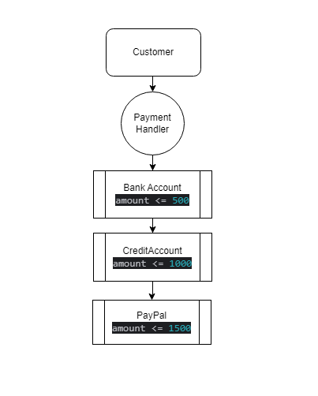

# Chain of Responsibility Design Pattern

The Chain of Responsibility design pattern is a behavioral design pattern that allows an object to pass a request along a chain of handlers.
Each handler in the chain decides either to process the request or to pass it along the chain to the next handler.
which allows an object to send a request to other objects without knowing who is going to handle it.

**Characteristics of the Chain of Responsibility Design Pattern**
        
        **Loose Coupling:** 
                This means the sender of a request doesn’t need to know which specific object will handle it. Similarly, the handler doesn’t need to
                understand how the requests are sent. This keeps the components separate and flexible.
        
        **Single Responsibility Principle**
                Each handler in the chain has one job: either to handle the request or to pass it to the next handler. This keeps the code organized and focused, 
                making it easier to manage.
                For our example for different account have different handler
        **Sequential Order** 
                Requests move through the chain one at a time. Each handler gets a chance to process the request in a specific order, ensuring consistency.
        **Fallback Mechanism** 
                If a request isn’t handled by any of the handlers, the chain can include a fallback option. This means there’s a default way to deal with requests 
                that don’t fit anywhere else.

Flow example :

