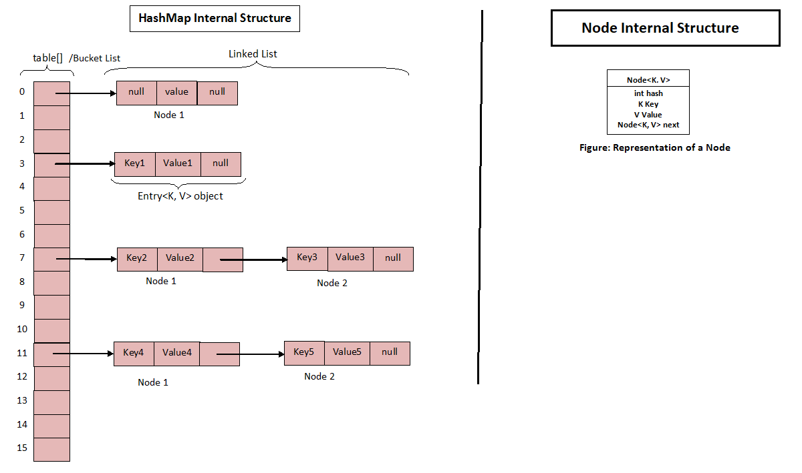

# <H1>`HashMap<>()` internal structure with `equals()` and `hashcode()` explanation. </h1><br/>

#### **HashMap :**  <br/>

HashMap is a one type of collection in Java collection framework to store values in key and value pair.
HashMap uses hashing technique for storing values. HashMap uses internal data structure as array and LinkedList
for storing key and values. HashMap contains an array of nodes, and node presented by a class with respect to key.

Before discussing internal working of HashMap, we should understand **`hashCode()`** and **`equals()`**
method contract in detail.
<br/>

### I have already explained about `equal()` and `hashCode()` <button>[click here.](../equalAndHashCode.md)</button>



### **HashMapInternal With details using code example :** <br/>


`HashMap<>()` in Java is basically an array of buckets (also known as bucket table of `HashMap`) where each bucket uses
linked list to hold elements. A linked list is a list of nodes where each node contains a key-value pair.

In simple words, a bucket is a linked list of `nodes` where each node is an object of class `Node<K,V>`.
The key of the node is used to obtain the hash value and this hash value is used to find the bucket from `Bucket Table`.

`HashMap<>()` works on the principle of hashing data structure or technique that uses an object’s hashcode to place 
that object inside the map.

Hashing involves Bucket, Hash function (`hashCode()` method), and Hash value. 
It provides the best time complexity of` O(1)` for insertion and retrieval of objects.

Therefore, it is the best-suited data structure for storing key-value pairs that later on can be retrieved 
in minimum time.


When in create a `HashMap<>()` 

**For `HashMap<>()` there is 2 important params shared below,**
1) initialCapacity
2) loadFactor

When in create a `HashMap<>()`  object without any params like below snips,

```java
public class Test{
    public static void main(String[] args) {
        Map map = new HashMap<>();
    }
}
``` 
it will create the `HashMap<>()`  object and this  `HashMap<>()` internally create this object based on two default params
**initialCapacity** and **loadFactor** and using these default params have some default as like shared below,

1) initialCapacity =>  The default initial capacity of `` is `16` (i.e. **the number of buckets**)
2) loadFactor => By default, it is` 0.75` means (75%) 

**Let's discuss first about these important params of `HashMap<>()` in more details.**

**1) Initial Capacity  :** Initial Capacity is a measure of the number of buckets or size of bucket array internally by HashMap at the time of the creation of HashMap.

The default initial capacity of HashMap is `16` **(i.e. the number of buckets).** 
It is always expressed in the power of 2 (2, 4, 8, 16, etc.) reaching maximum of 1 << 30 (2^30).

**2) Load Factor  :** Load Factor is a factor that is internally used by **HashMap** to determine when the size of Bucket
array requires to be increased. By default, it is **0.75**. we are able to use max `1.0f` as param means `100%` but it will create 
performance issue.

When the number of nodes in the HashMap is more than **75%** of total capacity, HashMap grows its bucket array size. 
The capacity of **HashMap** always doubled each time when HashMap needs to be increased its bucket array size.


**Before discuss about  `HashMap<>()` lets see some important internal property of the  `HashMap<>()` from `JAVA 8`**

```java
public class HashMap<K,V> extends AbstractMap<K,V>
    implements Map<K,V>, Cloneable, Serializable {
    /**
     * The load factor used when none specified in constructor.
     */
    static final float DEFAULT_LOAD_FACTOR = 0.75f;


    public V put(K key, V value) {
        return putVal(hash(key), key, value, false, true);
    }

    static final int hash(Object key) {
        int h;
        return (key == null) ? 0 : (h = key.hashCode()) ^ (h >>> 16);
    }

    public V get(Object key) {
        Node<K,V> e;
        return (e = getNode(hash(key), key)) == null ? null : e.value;
    }
    public boolean containsKey(Object key) {
        return getNode(hash(key), key) != null;
    }

    /**
     * Basic hash bin node, used for most entries.  (See below for
     * TreeNode subclass, and in LinkedHashMap for its Entry subclass.)
     */
    static class Node<K,V> implements Map.Entry<K,V> {
        final int hash;
        final K key;
        V value;
        Node<K,V> next;

        Node(int hash, K key, V value, Node<K,V> next) {
            this.hash = hash;
            this.key = key;
            this.value = value;
            this.next = next;
        }
        //have some others code which is less important for this explanation 
    }
}
```

<h2>Let's discuss actual implementation of **HashMap<>()**</h2><br/>


If you face any difficulties to understand the above picture provided java 8 provided hash function
please [click here](https://youtu.be/TllHVJGEY5A). Hope this will helpful for better understanding.


```java
public class Test {
    public static void main(String[] args) {
        //Map<String,Integer> mapWithParams  = new HashMap<>(18,1.0f);
        Map<String,Integer> map  = new HashMap<>();
        map.put("Kibria",1);
        map.put("Rabbani",2);
        map.put("Rakib",3);
        map.put("Maleka Banu",3);
    }
}
```
**1)** We put some value to **HashMap<>()** when hashmap going to put **HashMap<>()** internally
convert the provided key to a int `hashcode` using a `hash()` function provided by **HashMap<>()**

**2)** Now calculate the index of the bucket using below code,
```java
  hash("Kibria") & (16-1);
```
you can find a full sample on the above shared snips.
Here 16 is the initial capacity for default implementation.
based on the initial capacity `HashMap<>()` internally assigned the bucket size based on the initialCapacity.

`HashMap<>()` internally calculate the resizeable index (threshold) Based on the **initialCapacity = 16** and **loadFactor = 0.75f** by calculate below math,

`threshold = (initialCapacity * loadFactor) = 12`

In a HashMap in Java, the "threshold" refers to the point at which the hash table will be
resized to accommodate more elements. The threshold is a dynamic value that is calculated 
based on the initial capacity and the load factor when the HashMap is created.

**Here's how the threshold is typically calculated:**
            
            1) **Initial Capacity:** This is the number of buckets (or slots) initially allocated in the hash table.
            It's often set to a power of 2 (e.g., 16, 32, 64, etc.). When you create a HashMap, you can specify the
            initial capacity as an argument.

            2) **Load Factor:** The load factor is a value between 0 and 1 that determines how full the hash table can get 
            before it is resized. The default load factor in Java's HashMap is 0.75, meaning that the table will be
            resized when it becomes 75% full.

            3) **Threshold Calculation:** The threshold is calculated as the product of the current capacity and
            the load factor. For example, if the initial capacity is 16 and the load factor is 0.75, the threshold
            would be 16 * 0.75 = 12.

            When you add elements to the HashMap, it keeps track of the number of elements currently in the map.
            When this number exceeds the threshold, the HashMap is resized to a larger capacity, usually doubling the 
            previous capacity. The new threshold is recalculated based on the new capacity and load factor.
            
            This dynamic resizing of the HashMap helps balance memory usage and performance. It ensures that the HashMap
            doesn't become too crowded, which can result in inefficient lookup times, while also avoiding excessive memory
            consumption.


            but if you pass any params like the above code snips commented `HashMap<>()` object called **mapWithParams**
            then the full process will process in same way but based on the provided **initialCapacity and loadFactor** not the default
            value of these params
            
            You can see the above screen snips for more details

**3)** Now say the calculated index sequence as per the 2 number code snips `hash("Kibria") & (16-1)` example the 
calculated index sequence is : (7,5,4) as like below code,
```java
public class Test {
    public static void main(String[] args) {
        Map<String,Integer> map  = new HashMap<>();
        map.put("Kibria",1);// hash("Kibria") & (16-1) = index = 7
        map.put("Rabbani",2);// hash("Rabbani") & (16-1) = index = 5
        map.put("Rakib",3);// hash("Rakib") & (16-1) = index =  4
    }
}
```
so these putted value will store to the bucket list by the calculated sequence sending order to the node with the calculated `hascode`
for example if any index number is same with the previously added any index number the `HashMap<>()` added the putted 
value to same index in the different node as child of previously added node by make a relationship with the calculated hash.
when we wanna retrieved these all values from `HashMap<>()` these value will return based on the added index based 
bucket index and for double node bucket retrun value sequentially by parent child means parent first then child.

for multiple node for a bucket when the node size exceeds usually 8 it will move to Linked List 
to tree node based architecture that will help us to insure performance.

**3)** Good to know, when `HashMap<>()` internally call `hashCode()` of the key if the is String like the above code snips
then the `hashCode()` will calculate by the String provided `hashCode()` method. same for Integer and for Other like for a class it will call the class defined default or
custom  `hashCode()` method and for List<Object> it will call the List implementation class like `ArrayList<>();`
provided `hashCode()`.


**4)** when we wanna get any value by a key from the `HashMap<>()` the `HashMap<>()` internally called same way `hashCode()`
for the provided key and the `HashMap<>()` goes to find the expected value from bucket list Nodes by the calculated `hashCode()`.
if not found it will return `null` even the provided key is same but object state is different because changed object 
return different `hashCode()`. Here object state means if in the object have our custom `hashCode()` method.
For more details about `hashCode()` <button>[click here.](../equalAndHashCode.md)</button>