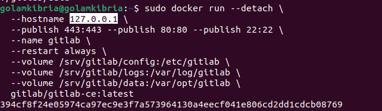

# How to Install GitLab CE (Community Edition) with Docker on Ubuntu

**_You need to ensure that in your system Docker installed and working fine._**

## Step 1: Install GitLab CE with Docker:

_Now, let’s use Docker containers to install GitLab CE:_

**A)  Pull the latest GitLab CE Docker image:**

```
sudo docker pull gitlab/gitlab-ce:latest
```

**B) Create a directory to store GitLab’s configuration and data:**

```
sudo mkdir -p /srv/gitlab/config /srv/gitlab/logs /srv/gitlab/data
```

**C) Run the GitLab CE Docker container:**
```
sudo docker run --detach \
  --hostname YOUR_SERVER_IP \
  --publish 443:443 --publish 80:80 --publish 22:22 \
  --name gitlab \
  --restart always \
  --volume /srv/gitlab/config:/etc/gitlab \
  --volume /srv/gitlab/logs:/var/log/gitlab \
  --volume /srv/gitlab/data:/var/opt/gitlab \
  gitlab/gitlab-ce:latest
```
Here, In **YOUR_SERVER_IP** i have used localhost IP : ```127.0.0.1```

Replace YOUR_SERVER_IP with your server’s IP address or domain name.




## Step 2: Configure GitLab CE with Docker

**A) Set a new password for your GitLab CE with Docker panel.**

_1) Run the following command to access the GitLab container’s shell:_
```
sudo docker exec -it gitlab /bin/bash
```
_2) Once inside the container’s shell, run the following command to reset the root user’s password:_

```
gitlab-rake "gitlab:password:reset"
```


You’ll be asked to enter the username for which you’d like to reset the password. Enter root as the username and hit the Enter key.


Following that, you should receive confirmation that the password reset was successful.


Enter exit and press Enter to exit the container’s shell.


_3) Restart the Docker_

```
sudo systemctl restart docker
```

**B) Access GitLab CE with Docker web interface.**

Open your browser and enter http://YOUR_SERVER_IP or http://YOUR_DOMAIN_NAME.


